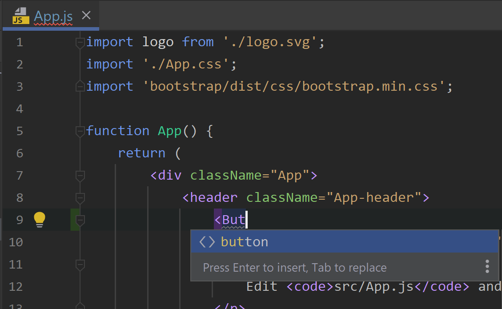
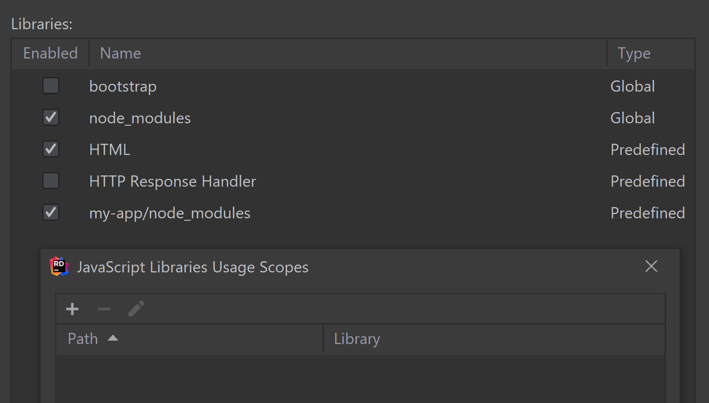
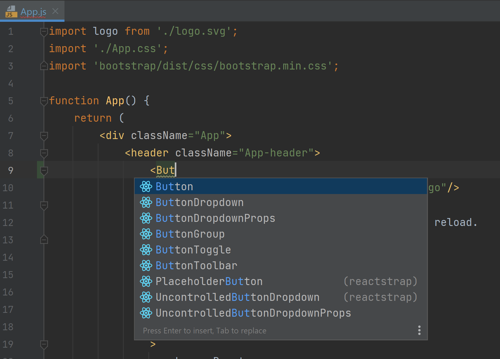
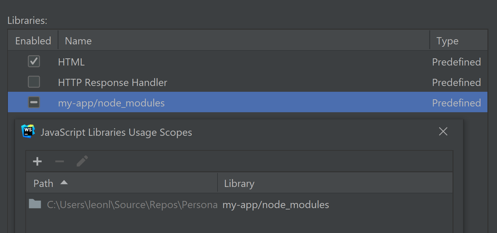

# RIDER-73158

In Rider 2021.3.2, try getting auto completion for any Reactstrap component in App.js. For example `<Button />`.

At least when using my settings from the included settings.zip.

Javascript plugin is enabled.

See it fail:

It works in WebStorm (Unless I import the Rider settings. Don't want to reset my Rider settings..)

